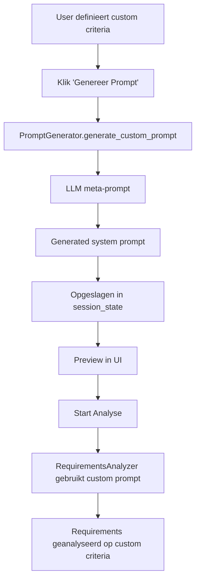

# Custom Criteria Feature - LLM-Generated Dynamic Prompts

## 📖 Overview

De ISO/IEC/IEEE 29148 Requirements Analyzer ondersteunt nu **custom criteria** - je kunt je eigen kwaliteitscriteria definiëren en de analyzer past automatisch de LLM prompt aan om requirements te evalueren op basis van jouw criteria.

## 🎯 Use Case

**Scenario:** Je werkt aan een project met specifieke requirements zoals Security, Performance, of Domain-specific criteria die niet worden gedekt door de standaard ISO 29148 criteria.

**Oplossing:** Definieer je eigen custom criteria, en een LLM genereert automatisch een aangepaste analysis prompt die jouw requirements evalueert op basis van jouw criteria.

## 🚀 Workflow

### **Stap 1: Custom Criteria Definiëren**

Navigeer naar: **5_🔍_Criteria** pagina → **Tab 1: 📖 Criteria Referentie** → Scroll naar beneden naar **🎨 Custom Criteria**

1. Vink **"🔄 Gebruik Custom Criteria voor Analyse"** aan
2. Voeg criteria toe met het formulier rechts:
   - **Criterium Naam**: Bijvoorbeeld "Security" of "Performance"
   - **Beschrijving**: Wat evalueert dit criterium?
   - **Guidance** (optioneel): Hoe moet dit criterium geëvalueerd worden?

**Voorbeeld Custom Criteria:**

```
Naam: Security
Beschrijving: De requirement moet voldoen aan security best practices en geen kwetsbaarheden introduceren.
Guidance: Check op gebruik van encryption, authentication, authorization, input validation, en OWASP top 10.
```

```
Naam: Performance
Beschrijving: De requirement moet specifieke en meetbare performance eisen bevatten.
Guidance: Controleer op concrete metrics zoals response time, throughput, of resource usage limits.
```

### **Stap 2: LLM-Generated Prompt Preview**

Na het toevoegen van custom criteria, klik op:
**"🔄 Genereer Preview van Aangepaste Prompt"**

De LLM (o3-mini-1) genereert een volledige system prompt die:
- Alle jouw custom criteria bevat
- De juiste JSON output structuur specificeert
- In het Nederlands is geformuleerd

**Preview** de gegenereerde prompt om te verifiëren dat deze correct is.

### **Stap 3: Requirements Analyseren**

Navigeer naar: **2_⚙️_Analysis** pagina

Je ziet nu:
```
🎨 Custom Criteria Mode Actief - 3 custom criteria zullen worden gebruikt
```

Klik op **"▶️ Start ISO 29148 Analyse"**

De analyzer gebruikt nu de **LLM-generated custom prompt** om requirements te evalueren op basis van jouw criteria!

## 🏗️ Technische Architectuur

### **Components**

#### **1. Prompt Generator (`utils/prompt_generator.py`)**

```python
class PromptGenerator:
    def generate_custom_prompt(self, custom_criteria: List[Dict]) -> str:
        """
        Gebruikt een LLM (meta-prompt) om een aangepaste analysis prompt te genereren.

        Input: Custom criteria (naam, beschrijving, guidance)
        Output: Volledige system prompt voor requirements analysis
        """
```

**Meta-Prompt Strategie:**
- Geeft de LLM een template van hoe een analysis prompt eruit moet zien
- Voorziet de custom criteria als input
- Instrueert de LLM om een gestructureerde prompt te genereren met:
  - Criteria definities
  - JSON output specificatie
  - Nederlandse taal requirement

#### **2. Analyzer Update (`utils/analyzer.py`)**

```python
class RequirementsAnalyzer:
    def __init__(self, ..., custom_system_prompt: Optional[str] = None):
        """
        Accepteert optioneel een custom system prompt.
        Gebruikt standaard ISO 29148 prompt als custom_system_prompt None is.
        """
```

#### **3. UI Integration (`pages/5_🔍_Criteria.py`)**

**Tab 1: Criteria Referentie** bevat nu:
- ISO 29148 criteria referentie (standaard)
- **Nieuwe sectie:** Custom Criteria management
  - Toggle: Gebruik custom criteria aan/uit
  - Form: Custom criterion toevoegen
  - Preview: LLM-generated prompt bekijken

#### **4. Analysis Integration (`pages/2_⚙️_Analysis.py`)**

```python
# Check if custom criteria enabled
use_custom_criteria = st.session_state.get('use_custom_criteria', False)

if use_custom_criteria:
    # Generate or load custom prompt
    custom_prompt = generator.generate_custom_prompt(custom_criteria)

    # Pass to analyzer
    analyzer = RequirementsAnalyzer(..., custom_system_prompt=custom_prompt)
```

## 📊 Session State Management

Nieuwe session state variables:

| Key | Type | Beschrijving |
|-----|------|--------------|
| `custom_criteria` | List[Dict] | Lijst van user-defined criteria |
| `use_custom_criteria` | bool | Toggle: gebruik custom criteria of ISO 29148 |
| `generated_custom_prompt` | str | Door LLM gegenereerde custom system prompt |

**Persistentie:**
- Custom criteria blijven in session state tijdens de hele sessie
- Generated prompt wordt gecached - geen herhaalde LLM calls nodig

## 🔄 Prompt Generation Flow



## 📝 Voorbeeld Output

**Custom Criteria:**
1. Security
2. Performance
3. Compliance

**LLM-Generated Prompt** (excerpt):
```
U bent een expert in requirements engineering...

Evalueer elke eis op de volgende kwaliteitscriteria:

1. SECURITY: Voldoet de requirement aan security best practices?
2. PERFORMANCE: Bevat de requirement specifieke en meetbare performance eisen?
3. COMPLIANCE: Voldoet de requirement aan relevante wet- en regelgeving?

...

- "security": boolean
- "security_justification": string in Nederlands
- "performance": boolean
- "performance_justification": string in Nederlands
...
```

**Analysis Results:**
```json
{
  "id": "REQ-001",
  "security": true,
  "security_justification": "Deze eis specificeert encryption voor gevoelige data, wat voldoet aan security best practices.",
  "performance": false,
  "performance_justification": "Geen specifieke performance metrics gedefinieerd...",
  "quality_score": 2,  // 2 out of 3 criteria passed
  "suggestion": "Voeg meetbare performance criteria toe..."
}
```

## ⚙️ Configuratie

### **Azure OpenAI Requirements**

Custom criteria feature gebruikt **2 LLM calls**:

1. **Prompt Generation** (eenmalig)
   - Model: o3-mini-1 (configurable)
   - Temperature: 0.3 (lagere temperature voor consistentie)
   - Max tokens: 4000

2. **Requirements Analysis** (per batch)
   - Model: o3-mini-1 (configurable)
   - Gebruikt de generated custom prompt
   - Batch size: 5 requirements (default)

### **Cost Implications**

- **Eenmalige cost:** 1 extra LLM call voor prompt generation (~1000-2000 tokens)
- **Recurring cost:** Zelfde als standaard analysis (custom prompt ~= ISO 29148 prompt in lengte)

## 🔒 Fallback Behavior

Als custom criteria mode actief is MAAR:
- Geen custom criteria gedefinieerd → Terugvallen op ISO 29148
- Prompt generation faalt → Terugvallen op ISO 29148
- Custom prompt is leeg → Terugvallen op ISO 29148

**User feedback** wordt getoond in de UI bij fallback.

## 🧪 Testing

### **Manual Test Scenario**

1. Ga naar Criteria pagina → Tab 1
2. Voeg 2-3 custom criteria toe (bijv. Security, Performance)
3. Vink "Gebruik Custom Criteria" aan
4. Klik "Genereer Preview" → Verifieer dat prompt correct is
5. Ga naar Analysis pagina
6. Start analyse
7. Check results → Verifieer dat results custom criteria bevatten

### **Expected Results**

- ✅ Analysis results bevatten velden voor elk custom criterium
- ✅ `quality_score` = 0 tot N (N = aantal custom criteria)
- ✅ Justifications zijn in het Nederlands
- ✅ Suggestions zijn relevant voor de custom criteria

## 🛡️ Limitations & Future Work

### **Current Limitations**

1. **Dashboard Visualizations**: Dashboard is hardcoded voor ISO 29148 criteria (8 criteria)
   - Met custom criteria (bijv. 3 criteria) werken de grafieken nog niet optimaal

2. **Criteria Analysis Tab**: Tab 2 op Criteria pagina toont alleen ISO 29148 criteria
   - Custom criteria hebben nog geen dedicated analysis view

3. **Export Formats**: Excel/CSV export bevat custom criteria fields, maar kolom headers zijn technisch (bijv. `security`, `security_justification`)

### **Future Enhancements**

- [ ] Dynamic dashboard die zich aanpast aan aantal custom criteria
- [ ] Custom criteria analysis view in Tab 2
- [ ] Preset criteria templates (Security Pack, Performance Pack, etc.)
- [ ] Import/Export custom criteria definitions
- [ ] Criteria versioning en history

## 📚 Code References

| Component | File | Key Functions |
|-----------|------|---------------|
| Prompt Generator | [utils/prompt_generator.py](utils/prompt_generator.py) | `generate_custom_prompt()`, `_format_criteria_for_meta_prompt()` |
| Analyzer | [utils/analyzer.py](utils/analyzer.py) | `__init__(..., custom_system_prompt)`, `analyze_batch_with_llm()` |
| Criteria UI | [pages/5_🔍_Criteria.py](pages/5_🔍_Criteria.py:78-207) | Custom criteria management form |
| Analysis Integration | [pages/2_⚙️_Analysis.py](pages/2_⚙️_Analysis.py:117-170) | Custom prompt detection en generation |

## 🎓 Best Practices

### **Writing Good Custom Criteria**

✅ **DO:**
- Wees specifiek in de beschrijving
- Geef concrete guidance hoe het criterium te evalueren
- Gebruik domeintaal die relevant is voor je project
- Test met een paar requirements voordat je grote batches analyseert

❌ **DON'T:**
- Overlap met bestaande ISO 29148 criteria (tenzij bewust)
- Vage criteria zonder guidance (LLM kan ze verkeerd interpreteren)
- Te veel criteria (>10) - analysis wordt traag en complex

### **Example: Domain-Specific Criteria**

**Voor Automotive Software:**
```
Naam: ISO 26262 Compliance
Beschrijving: De requirement moet voldoen aan ISO 26262 functional safety standaarden.
Guidance: Check op ASIL levels, safety goals, failure modes, en mitigation strategies.
```

**Voor Healthcare:**
```
Naam: HIPAA Compliance
Beschrijving: De requirement moet voldoen aan HIPAA privacy en security regels.
Guidance: Controleer op patient data protection, access controls, audit trails, en encryption requirements.
```

---

**Generated with LLM-powered custom criteria! 🤖**

Last Updated: 2025-10-16
